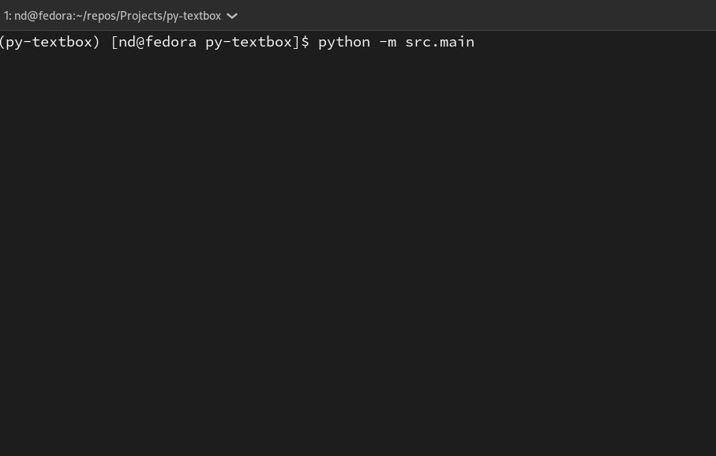

# py-textbox

a text input box for python

## Supports

- word wrap
- backspace across multiple lines
- dselete across multiple lines
- CTRL Left/Right to skip to the End or beginning of the next word
- pagination, up and down
- CTRL HOME and CTRL END to jumpo to the start or end of a document
- ALT S to save a file
- custom window width/height. Must be within wxisting limits
- line numbers which span split lines
- status bar with line cursor, line number, position and lenght information

## demo

